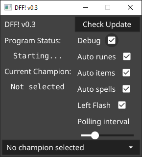

# DFF -- Automatic rune/item page/spell

### D for Flash!
DFF is a program that fetches data from op.gg to set runes, item pages, and spells automatically.

### Installation
1. Go to [release page](https://github.com/jaeha-choi/DFF/releases) to download the latest DFF.
2. Extract downloaded `DFF_win_v0.x.zip`
3. Edit `config` file to update the League client directory.

### Execution
1. Double click the `DFF_win_v0.x.exe` to execute DFF
2. Play games as you normally would.

### Disclaimer
DFF was created under Riot Games' "Legal Jibber Jabber" policy using assets owned by Riot Games.  Riot Games does not endorse or sponsor this project.
